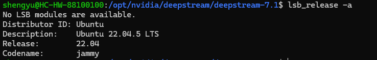
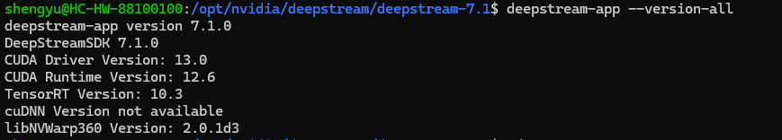
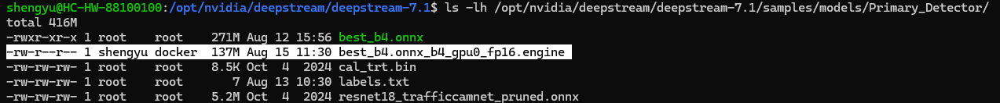

# DeepStream Pipeline Documentation

This project sets up a simple people detection and tracking pipeline using NVIDIA DeepStream 7.1. It simulates four parallel camera feeds by duplicating a single video input across four sources. This is ideal for testing and reproducibility.

NVIDIA DeepStream is a high-performance streaming analytics toolkit designed for building AI-powered video analytics applications.

---

## 🧩 Features

- ✅ People detection using pretrained ResNet18 (TrafficCamNet)
- ✅ Object tracking using NvDCF (nvmultiobjecttracker)
- ✅ Tiled display (2x2) showing 4 video feeds
- ✅ Video output saved to file (MP4)
- ✅ Runs on DeepStream 7.1 + WSL2 (Windows Subsystem for Linux)

---

## 🛠️ Version Used 





---

## 📥 Step-by-Step Instructions


### 1. Prepare the working environment/dir

```bash
sudo apt update && sudo apt upgrade
```

Change to deepstream working dir 


```bash
cd /opt/nvidia/deepstream/deepstream-7.1 
```

### 2. Copy a sample video of your choice to your Linux Folder Assuming the sample video is under the 'Videos' Folder on your windows machine

Make sure to replace 'YourWindowsUser' and 'YourLinuxUser' accordingly

```bash
cp /mnt/c/Users/YourWindowsUser/Videos/myvideo.mp4 /home/YourLinuxUser/myvideo.mp4
```

### 3. Create and edit the pipeline.txt 

```bash
sudo nano pipeline.txt 
```

Instructions:
- Copy the contents of the 'pipeline.txt' and paste it inside
- Make sure to change the 'URI file' in each SOURCE section accordingly to where you place your video 
- Also change the 'output-file' in the SINK1 section accordingly to where you want to save your video

### 4. Check available models and trackers 

List avilable detectors

```bash
ls -lh /opt/nvidia/deepstream/deepstream-7.1/samples/models/Primary_Detector/
```


There is no '.engine' file here, hence we build it.

List avilable trackers

```bash
ls /opt/nvidia/deepstream/deepstream/lib/ 
```

### 5. Create and edit the config_infer_primary.txt

```bash
sudo nano config_infer_primary.txt 
```

Instructions:
- Copy the contents of the 'config_infer_primary.txt' and paste it inside

### 6. Run the pipeline and build the engine file

Enable permission to write the built engine file into this dir first

```bash
sudo chmod -R a+rw /opt/nvidia/deepstream/deepstream-7.1/samples/models/Primary_Detector
```
Then, run the pipeline

```bash
deepstream-app -c /opt/nvidia/deepstream/deepstream-7.1/pipeline.txt
```

You should be able to see the Deepstream interface. 

After running the pipeline, check if the engine file is built

```bash
ls -lh /opt/nvidia/deepstream/deepstream-7.1/samples/models/Primary_Detector/
```



As seen here, there is an engine file now, so whenever we run the pipeline, we don't have to built the engine from scratch.

### 7. Edit the config_infer_primary again

```bash
sudo nano config_infer_primary.txt
```

Instruction:
- Comment OUT the 'infer_dims' in the PROPERTY section
- Comment OUT the 'onnx_file' in the PROPERTY section
- UNCOMMENT the 'model-engine-file' in the PROPERTY section

### 8. Run the pipeline and save the video onto the  windows machine

```bash
deepstream-app -c /opt/nvidia/deepstream/deepstream-7.1/pipeline.txt
```

The process should load much faster since we don't have to built the engine file.

LEFT CLICK to zoom in to one video/source and RIGHT CLICK to zoom out<br>

[OPTIONAL]
🔻🔻🔻

```bash
cp /home/YourLinuxUser/output_tiled.mp4 /mnt/c/Users/YourWindowsUser/Videos/output.mp4
```

To save the outtputed video onto your windows machine

---

## 📚 Resources and notes

- [NVIDIA DeepStream SDK Documentation](https://docs.nvidia.com/metropolis/deepstream/dev-guide/index.html)

Note:
My Deepstream was installed from the tar package

---
