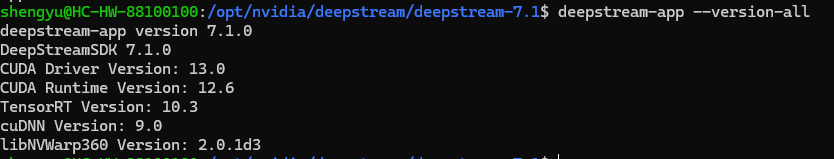

# DeepStream Pipeline Documentation

NVIDIA DeepStream is a high-performance streaming analytics toolkit designed for building AI-powered video analytics applications.

This project sets up a simple people detection and tracking pipeline using NVIDIA DeepStream 7.1. It simulates four parallel camera feeds by duplicating a single video input across four sources. This is ideal for testing and reproducibility.<br>

---

## 🧩 Features

- ✅ Custom People detection using a custom model that takes 4 batches
- ✅ Object tracking using multiple trackers (IOU, NvSORT, NvDeepSORT and NvDCF)
- ✅ Tiled display (2x2) showing 4 video feeds
- ✅ Video output saved to file (MP4)
- ✅ Runs on DeepStream 7.1 + WSL2 (Windows Subsystem for Linux)
<br>

---

## 🎁 Prerequisites


### To install cuDNN for DeepStream [OPTIONAL]

Install cuDNN 9.12 tar file using wget

```bash
sudo wget https://developer.download.nvidia.com/compute/cudnn/redist/cudnn/linux-x86_64/cudnn-linux-x86_64-9.12.0.46_cuda12-archive.tar.xz
```

Extract the archive

```bash
tar -xvf cudnn-linux-x86_64-9.12.0.46_cuda12-archive.tar.xz
```

Navigate to the cuDNN archive folder

```bash
cd cudnn-linux-x86_64-9.12.0.46_cuda12-archive
```

Copy cuDNN headers and libraries to CUDA include directory\

```bash
sudo cp include/cudnn*.h /usr/local/cuda/include/
sudo cp lib/libcudnn* /usr/local/cuda/lib64/
```

Give read permissions to cuDNN

```bash
sudo chmod a+r /usr/local/cuda/include/cudnn*.h /usr/local/cuda/lib64/libcudnn*
```

Create essential symbolic links

```bash
cd /usr/local/cuda/lib64
sudo ln -sf libcudnn.so.9.12.0 libcudnn.so.9
sudo ln -sf libcudnn.so.9 libcudnn.so
sudo ln -sf libcudnn_cnn.so.9.12.0 libcudnn_cnn.so.9
sudo ln -sf libcudnn_cnn.so.9 libcudnn_cnn.so
sudo ln -sf libcudnn_adv.so.9.12.0 libcudnn_adv.so.9
sudo ln -sf libcudnn_adv.so.9 libcudnn_adv.so
```

And finally update the linker cache

```bash
sudo ldconfig
```

---

## 🛠️ Version Used 


 
<br>
⬆️⬆️⬆️
With cuDNN 9.12 installed
<br>

---


## 📥 Step-by-Step Instructions


### 1. Prepare the working environment/DIR

```bash
sudo apt update
```

Install gedit which is a notepad like environment for Linux Ubuntu

```bash
sudo apt install gedit -y
```

Change to DeepStream working DIR 

```bash
cd /opt/nvidia/deepstream/deepstream-7.1 
```
<br>

### 2. Prepare sample video and reID model(for some tracking configs)

Make sure to replace 'YourWindowsUser' and 'YourLinuxUser' accordingly

(assuming the sample video is under the 'Videos' Folder on your windows machine)
```bash
cp /mnt/c/Users/YourWindowsUser/Videos/myvideo.mp4 /home/YourLinuxUser/myvideo.mp4 
```

Create a new DIR to place the reID model to be used for tracking later on

```bash
sudo mkdir /opt/nvidia/deepstream/deepstream-7.1/samples/models/Tracker/
```

Downloading reID model .etlt file and saving it into the newly created DIR

```bash
sudo wget 'https://api.ngc.nvidia.com/v2/models/nvidia/tao/reidentificationnet/versions/deployable_v1.0/files/resnet50_market1501.etlt' -P /opt/nvidia/deepstream/deepstream-7.1/samples/models/Tracker/
```
<br>

### 3. Create and edit the pipeline.txt 

```bash
sudo gedit pipeline.txt 
```

Instructions:
- Copy the contents of the 'pipeline.txt' and paste it inside
- Make sure to change the 'URI file' in each SOURCE section accordingly to where you place your video 
- Also change the 'output-file' in the SINK1 section accordingly to where you want to save your video
<br>

### 4. Prepare Custom detector and tracker

Make sure to replace 'YourWindowsUser' and 'YourLinuxUser' accordingly 

(assuming the custom detector is under the 'Downloads' Folder on your windows machine)

```bash
cp /mnt/c/Users/YourWindowsUser/Downloads/best_b4.onnx /opt/nvidia/deepstream/deepstream-7.1/samples/models/Primary_Detector/best_b4.onnx
```

Manually build the engine file using trtexec

```bash
/usr/src/tensorrt/bin/trtexec \
  --onnx=/opt/nvidia/deepstream/deepstream-7.1/samples/models/Primary_Detector/best_b4.onnx \
  --saveEngine=/opt/nvidia/deepstream/deepstream-7.1/samples/models/Primary_Detector/best_b4.onnx_b4_gpu0_fp16.engine \
  --fp16
```

List available detectors

```bash
ls -lh /opt/nvidia/deepstream/deepstream-7.1/samples/models/Primary_Detector/
```


You should be able to see the custom detector with the '.engine' file built.
<br>

List available trackers

```bash
ls -lh /opt/nvidia/deepstream/deepstream-7.1/samples/configs/deepstream-app
```


You should be able to see only 6 different config_tracker yml files
<br>

### 5. Prepare the config_infer_primary.txt and parser

```bash
sudo gedit config_infer_primary.txt 
```

Instructions:
- Copy the contents of the 'config_infer_primary.txt' and paste it inside 

```bash
sudo gedit /opt/nvidia/deepstream/deepstream-7.1/sources/libs/nvdsinfer_customparser/parser.cpp
```

Instructions:
- Copy the contents of the 'parser.cpp' and paste it inside 
<br>

Then recompile the parser into a .so file

```bash
sudo g++ -shared -fPIC -o /opt/nvidia/deepstream/deepstream-7.1/sources/libs/nvdsinfer_customparser/libcustomparser.so "/opt/nvidia/deepstream/deepstream-7.1/sources/libs/nvdsinfer_customparser/parser.cpp"   `pkg-config --cflags --libs gstreamer-1.0`   -I/opt/nvidia/deepstream/deepstream-7.1/include   -I/opt/nvidia/deepstream/deepstream-7.1/sources/includes   -I/usr/local/cuda/include
```
<br>

### 6. Run the pipeline and save the video

Run the pipeline

```bash
deepstream-app -c /opt/nvidia/deepstream/deepstream-7.1/pipeline.txt
```

You should be able to see the Deepstream interface like this 
<br>


<br>

LEFT CLICK to zoom in to one video/source and RIGHT CLICK to zoom out
<br>

[OPTIONAL]<br>
🔻🔻🔻

```bash
cp /home/YourLinuxUser/output_tiled.mp4 /mnt/c/Users/YourWindowsUser/Videos/output.mp4
```

To save the outtputed video onto your windows machine. 
(Make sure to change 'YourLinuxUser' and 'YourWindowsUser' accordingly) 
<br>

### 6. Trying out multiple tracker configs (IOU, NvSORT, NvDeepSORT and NvDCF) provided by DeepStream

Change reID model paths in NvDeepSORT.yml and NvDCF_accuracy.yml

```bash
sudo gedit /opt/nvidia/deepstream/deepstream-7.1/samples/configs/deepstream-app/config_tracker_NvDeepSORT.yml
```


#### Old path
/opt/nvidia/deepstream/deepstream/samples/models/Tracker/resnet50_market1501.etlt

#### Updated path 
/opt/nvidia/deepstream/deepstream7.1/samples/models/Tracker/resnet50_market1501.etlt
<br>
<br>
Do the same for NvDCF_accuracy.yml

```bash
sudo gedit /opt/nvidia/deepstream/deepstream-7.1/samples/configs/deepstream-app/config_tracker_NvDCF_accuracy.yml
```

Check that the reID model exist

```bash
ls -lh /opt/nvidia/deepstream/deepstream-7.1/samples/models/Tracker/
```

 <br>

Now open the pipeline.txt

```bash
sudo gedit pipeline.txt
```

Scroll down to the TRACKER section of the pipeline.txt until you see the highlighted section below which we can observe 6 different tracker configs


Instruction:
- Only UNCOMMENT whichever tracker "ll-config-file" you want to use
- Leave only one "ll-config-file" UNCOMMENTED at a time and the rest Commented OUT
- Then run the pipeline and save the video to your local
<br>


- The NvDCF_accuracy and NvDeepSORT tracker configs uses the reID model we installed earlier
- And as seen in the image we do not have an engine file built. 
- If you want to build the engine we need to install TAO-toolkit to build the engine from the reID model(.etlt file) otherwise it will run with default values or both NvDCF_accuracy and NvDeepSORT


---


## 📚 Resources and notes

- [NVIDIA DeepStream SDK Documentation](https://docs.nvidia.com/metropolis/deepstream/dev-guide/index.html)

### Notes:
- My Deepstream was installed from the tar package
- The ouput video using each tracker can be found inside the Videos folder in this repository

#### Tracker Performance Comparison

The table below summarizes the FPS performance of different trackers tested on the same video source.

| Trackers          | FPS Range   | Average FPS |
|-----------------|----------------|------------------|
| IOU Tracker      | 13.22 – 16.87   | 13.6            |
| NvDCF_perf       | 13.28 – 21.93   | 14.1          |
| NvDCF_max_perf   | 13.27 – 18.57   | 13.9            |
| NvDCF_accuracy(used default values)   | 13.20 – 15.71   | 13.5           |
| NvSORT           | 13.29 – 20.12   | 14.0           |
| NvDeepSORT(used default values)      | 13.23 – 16.96   | 13.7            |

---
